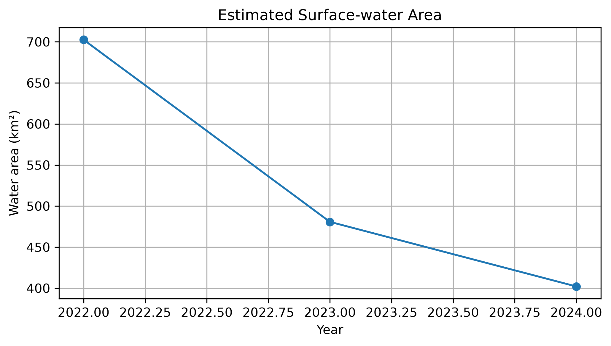
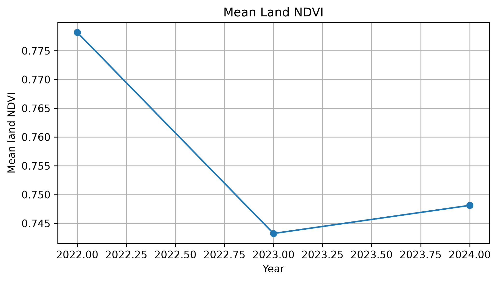

# Lake Tefé Drought Monitoring with Google Earth Engine and Python

Remote-sensing analysis of surface-water and vegetation changes around Lake Tefé, Amazonas, Brazil, between 2022 and 2024.

The project combines **Sentinel-2**, **CHIRPS**, **Google Earth Engine**, and **Python** to build a reproducible environmental change-detection workflow.

## Key Results

| Year | Water area (km²) | Change from 2022 | Mean land NDVI |
|---|---:|---:|---:|
| 2022 | 702.55 | 0.0% | 0.778 |
| 2023 | 480.79 | -31.6% | 0.743 |
| 2024 | 402.11 | -42.8% | 0.748 |

Detected surface-water extent decreased substantially relative to the 2022 reference period. Mean NDVI also decreased, although vegetation change was spatially heterogeneous.





## Workflow

**Sentinel-2 → cloud masking → seasonal composites → NDWI → water extent → NDVI → spatial change detection → CHIRPS precipitation → Pandas/Matplotlib outputs**

The main satellite comparison uses September–November composites for 2022, 2023, and 2024.

## Data and Tools

- Sentinel-2 Surface Reflectance (`COPERNICUS/S2_SR_HARMONIZED`)
- CHIRPS Daily precipitation
- Google Earth Engine Python API
- Python
- geemap
- Pandas
- Matplotlib
- JupyterLab

## Outputs

Interactive maps are available in `docs/`:

- `water_detection_2022.html`
- `ndvi_change_2022_2023.html`
- `ndvi_change_2022_2024.html`

Summary results are available in:

`data/results_summary.csv`

The complete analysis is documented in:

`notebooks/01_project_setup.ipynb`

## Project Structure

```text
amazon-drought-monitoring/
├── notebooks/
│   └── 01_project_setup.ipynb
├── data/
│   └── results_summary.csv
├── figures/
│   ├── water_area_change.png
│   └── mean_land_ndvi.png
├── docs/
│   ├── water_detection_2022.html
│   ├── ndvi_change_2022_2023.html
│   └── ndvi_change_2022_2024.html
└── README.md
```

## Limitations

- Water extent represents all detected water within the defined AOI, not an exact mapped boundary of Lake Tefé.
- A fixed NDWI threshold was used for water classification.
- Precipitation over the local AOI alone cannot explain the full hydrological response of the lake system.

## Skills Demonstrated

Remote sensing · multispectral imagery · cloud masking · spectral indices · raster analysis · spatial statistics · temporal change detection · Google Earth Engine · Python · environmental data analysis